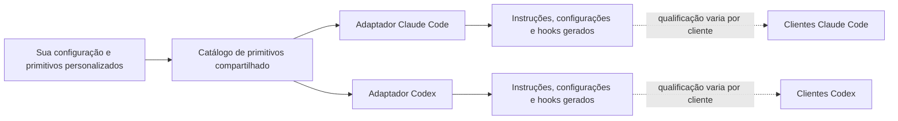

# Model Citizen

Antigamente chamado de Agent Harness.

[](https://github.com/JakeSelby/agent-harness/actions/workflows/ci.yml)
[](LICENSE)
[](CONTRIBUTING.md)
[](https://agent-harness.jakeselby.com)


> **Nota desta cópia:** este é um espelho traduzido para português do Brasil do projeto original [Model Citizen](https://github.com/JakeSelby/model-citizen), de Jake Selby, licenciado em MIT. Faz parte do repositório [Jev](../../README.md) do Ander, como material de referência — veja a nota de atribuição em [`referencias/README.md`](../README.md).

## A camada de controle para os seus agentes de código, do jeito que você os roda.


O Model Citizen é a camada por baixo dos seus agentes de código. Você escreve suas regras, habilidades, papéis e preferências uma única vez, como seus próprios "primitivos". O harness os projeta para o Claude Code e o Codex, aplica-os com hooks, e mantém um livro-razão do que cada sessão fez e gastou. Ele fica por baixo de qualquer biblioteca de regras que você goste e de qualquer orquestração que você rode, então você pode mudar como seus agentes trabalham sem mudar como você os executa.

Todo arquivo que ele toca entra num diário de propriedade, e a desinstalação devolve tudo ao lugar. O mesmo livro-razão exporta via OTLP para Langfuse, Phoenix ou Opik, desligado por padrão.

O Model Citizen não é um gateway de API de LLM, um provedor de modelo, nem um runtime de agente substituto. O Claude Code e o Codex continuam responsáveis pelo acesso ao modelo, pelas permissões nativas e pelo comportamento do cliente.

## O que ele faz por você

Os mesmos seis grupos ficam guardados como dados em [`product.json`](product.json), então esta lista, o site de referência e a descrição do GitHub não podem se desalinhar.

### Guardrails que deixam espaço para julgamento

Hooks cuidam das poucas coisas que deveriam ser determinísticas, e cada um tem um id que você pode desligar; os quatro que aplicam de fato precisam da sua confirmação primeiro. Tudo o mais fica a critério do agente.

- [Comandos de shell classificados](claude/hooks/grade-bash.py): todo comando recebe uma nota, de somente-leitura a irreversível, e sua preferência de autonomia, mais qualquer nível por repositório numa política local, decide quais notas param e perguntam.
- [Portão de parada (stop gate)](claude/hooks/stop-gate.py): o turno não termina enquanto o portão do seu próprio repositório estiver vermelho.
- [Revisão com contexto fresco](claude/agents/reviewer.md): o escopo é conferido contra o pedido, depois a qualidade, por agentes que nunca viram o código sendo escrito, e as revisões geradas por um framework próprio ficam sujeitas ao mesmo padrão, seja qual for o nome que usem.
- [Segredos e dados pessoais](primitives/rules/secrets.md): um lint pega tokens, chaves e strings pessoais antes de serem commitados.
- [Saída de ferramenta não confiável](claude/hooks/neutralize-tool-output.py): texto que volta de uma ferramenta é dado, nunca instrução.
- [Isolamento (sandboxing)](docs/sandboxing.md): isole o sistema de arquivos e a rede antes de deixar um loop sem supervisão.

### Configurações que são suas, em cada runtime que você usa

O sync mantém um diário do que mudou e recusa sobrescrever o que não é dele. A desinstalação devolve tudo. As mesmas regras então vão para os dois runtimes.

- [Reversível](docs/settings-ownership.md): o sync tem uma execução em modo teste, o diff mostra o que mudou, um diário de propriedade registra valores anteriores e aplicados, e a desinstalação restaura o que foi adotado.
- [Primitivos compartilhados](docs/sync-model.md): regras, habilidades, papéis e workflows moram num só lugar e sincronizam para as configurações nativas de cada runtime. Desligue um e o sync o deixa de fora dos dois.
- [A mesma política nos dois](docs/runtime-controls.md): uma invocação do Claude Code e uma do Codex resolvem para a mesma política de delegação.
- [Integrações declaradas](docs/bmad.md): um framework de planejamento se declara num único descritor. `citizen integration check|apply` instala suas substituições, e o hook de invocação confina suas camadas de revisão.
- [Compatibilidade honesta](docs/compatibility.md): o catálogo diz quais clientes estão qualificados e onde estão as lacunas: dois runtimes hoje, e o texto de destaque não afirma mais que isso.
- [Uma worktree por agente](primitives/skills/worktree-per-agent): agentes em paralelo não pisam no seu checkout nem uns nos outros.

### Veja e controle o que seus agentes gastam

Um teto rígido corta o agente depois que ele já gastou os tokens. Prefiro dizer a ele quanto as coisas custam e deixar que ele mesmo se controle.

- [Posturas de custo](primitives/stances/cost): escolha frugal, equilibrada ou máxima, ou escreva a sua. Uma tabela define modelo, esforço e um orçamento flexível por papel.
- [Escalonamento de modelo](primitives/stances/delegation): papéis pedem uma classe de capacidade — fronteira, forte, padrão ou leve —, não um nome de modelo. Reunir arquivos não roda no mesmo modelo que revisa seu código.
- [Trabalhadores por faixa](claude/agents/worker-a.md): uma invocação que não nomeia um papel recebe um trabalhador do tamanho certo, em vez do seu modelo mais caro.
- [Um orçamento em cada briefing](claude/hooks/brief-guard.py): cada subagente recebe seus tokens e chamadas de ferramenta esperados. Termina se estiver perto do limite, ou devolve o que já tem.
- [Feed de uso ao vivo](docs/usage.md): o orquestrador vê quanto cada turno e cada subagente custaram, e é avisado uma vez quando o contexto passa do tamanho que sua preferência define. Um log de decisões registra o que cada hook decidiu.
- [Contexto enxuto](docs/how-it-works.md): instruções sempre carregadas ficam limitadas a 225 linhas, e o lint reprova o commit que passar disso. Saída ruidosa de ferramenta é filtrada antes de chegar na transcrição.

### Respostas e planos que dá para ler de verdade

A maior parte da saída de um agente é uma parede de texto. Isto põe o veredito na frente e o pedido onde você consegue achar.

- [Preferências de voz](primitives/stances/voice): escolha conciso, cartão-resposta ou escaneável. Mesmo conteúdo, moldado para como você lê.
- [Estilo de saída escaneável](claude/output-styles/scannable.md): veredito primeiro, itens de ação num só lugar, e status em palavras simples: Corrigido, Parcialmente corrigido, Não corrigido, Não verificado.
- [Planos em formato "cartão de revisão"](primitives/skills/plan-authoring): todo plano abre com um cartão de uma tela só e para num portão de construção até você dizer "construir".
- [Retornos de subagente limitados](primitives/skills/transcript-hygiene): subagentes voltam com achados e um teto de palavras, não a transcrição inteira.
- [Regras de concisão](primitives/rules/conciseness.md): explique uma decisão uma vez. Comentários dizem o porquê, não o quê.

### Regras que dá para medir, e podar

Todo projeto deste campo escreve instruções e torce. Aqui, uma regra que ninguém consegue observar é uma regra que ninguém consegue podar, e o lint avisa isso antes do commit entrar.

Toda regra nomeia um detector determinístico sobre a própria transcrição do agente, ou diz em uma linha por que nada numa transcrição consegue decidir aquilo,
e o lint reprova o commit caso contrário. `citizen usage --rules` então relata quantas vezes cada regra disparou,
agrupado por repositório e pela variante de preferência que estava selecionada no momento.

- [Detector ou motivo](primitives/rules): toda regra nomeia um detector determinístico sobre a transcrição, ou diz em uma linha por que nada numa transcrição consegue decidir aquilo. O lint reprova o commit caso contrário.
- [Taxa de acerto por regra](docs/usage.md): `citizen usage --rules` relata quantas vezes cada regra disparou, por repositório e pela variante selecionada; `--by profile` divide o gasto pelo perfil por trás de cada linha.
- [Prefixo de cache mantido](docs/usage.md): `citizen usage --by prefix` relata a taxa de cache-miss de cada sessão e nomeia o turno em que ela saltou. Ele mede o prefixo; nada nega uma mudança.
- [O que é detectado](claude/hooks/rule-detectors.py): dezenove detectores determinísticos leem a transcrição: leituras de arquivo inteiro, pushes não verificados, segredos numa escrita, aberturas banidas, commits fora do padrão convencional.
- [Pego em flagrante](docs/field-scan.md): o instrumento já pegou duas funcionalidades lançadas deste próprio repositório não fazendo nada. As duas estão registradas como issues, não escondidas.
- [Exporta para onde você já olha](docs/telemetry.md): o mesmo livro-razão exporta via OTLP, desligado por padrão, para Langfuse, Phoenix ou Opik, adicionando a única coisa que eles não conseguem ver: qual regra disparou.

### Suas preferências, como interruptores

Desenvolvedores razoáveis discordam sobre testes, autonomia e o quanto delegar. Nove eixos, cada um uma escolha nomeada: três hoje se ligam a aplicação de fato, o resto é texto que troca de forma limpa.

- [Dimensões e variantes de preferência](primitives/stances): autonomia, delegação, testes, custo, voz, commits, planejamento, licenciamento e construir versus comprar.
- [Usuário, projeto, sessão](docs/preferences.md): defina um padrão ou escolha um modo, sobrescreva para um repositório ou sessão, e o agente segue a sobrescrita a partir da próxima sessão. `citizen selection` mostra o que definiu cada unidade.
- [Escreva a sua](docs/primitive-authoring.md): uma nova dimensão de preferência é uma pasta de arquivos Markdown. Sem precisar de fork.
- [Veja um interruptor de ponta a ponta](docs/stance-demo.md): a demonstração alterna a delegação e mostra o que muda nos dois runtimes.
- [Preferências de autonomia](primitives/stances/autonomy): executar, confirmar-escritas ou perguntar. A escolha define qual nota de comando de shell para e pergunta; é aplicado, não só sugerido.
- [Julgamento fica local por padrão](docs/runtime-controls.md): um provedor externo de julgamento fica desligado em todo ponto de decisão até você ligar, envia só os campos que você listar, e um único arquivo desliga todas as chamadas.

### A caminho

Planejado, não prometido.

- **Medido contra o básico:** o conjunto de provas 1 roda o harness contra o Claude Code puro, e `harness evidence verify` recalcula cada número publicado a partir das próprias linhas, seja qual for o resultado.
- **O modo superpoderes:** um interruptor entrega planejamento e testes ao Superpowers enquanto todo hook continua ligado, e `doctor` nomeia o modo quando encontra o plugin.

## O ciclo de entrega

Sete comandos carregam um pedaço de trabalho de uma pergunta até um pull request mesclado e uma
sessão encerrada, com olhos frescos na etapa de revisão: `/research`, `/plan`, `/build`, `/review`, `/land`,
`/handoff`, `/close-out` ([workflows](primitives/workflows)). Papéis nomeados ([builder, planner, reviewer,
gatherer, designer e outros](claude/agents)) cada um carrega uma classe de modelo e limites de ferramenta; a revisão é feita
por agentes que nunca viram o código sendo escrito; as preferências de teste e de commit
([testes obrigatórios, Conventional Commits, pushes com portão, ou desligue-os](primitives/stances/testing)) decidem
quão rígido é esse ciclo; e o briefing, a arquitetura e as histórias são [planejados publicamente](docs/bmad.md).
Todo projeto deste campo entrega um ciclo parecido com este, e é por isso que isto é uma seção, não uma alegação.

## Preferências que você pode trocar

Uma **preferência (stance)** é uma escolha nomeada sobre como você quer que um agente trabalhe. Padrões úteis já vêm
com o harness; cada escolha pode ser mudada de forma independente, e você pode adicionar suas próprias dimensões.

| Preferência | Escolhas incluídas hoje |
| --- | --- |
| Autonomia | `execute`, `confirm-writes`, `ask` |
| Delegação | `tiered`, `session-model`, `off` |
| Testes | `required`, `pragmatic`, `off` |
| Postura de custo | `frugal`, `balanced`, `max` |
| Formato de resposta | `scannable`, `concise`, `answer-card`, `off` |
| Cerimônia de plano | `review-card`, `light` |
| Commits | `conventional-attributed`, `conventional`, `as-you-go`, `off` |
| Licenciamento | `permissive-commercial`, `open-source`, `off` |
| Construir versus comprar | `capability-ceiling`, `off` |

Algumas preferências são instruções consultivas. Outras também selecionam hooks implementados ou configurações nativas.
`bin/harness stances --json` mostra a escolha resolvida, o modo do adaptador e o status de qualificação de
cada uma. Uma preferência nunca sobrepõe uma restrição nativa de um cliente.

**Padrões úteis. Preferências que você pode mudar. Primitivos que você pode estender.**

## Experimente com os runtimes que você já tem

Você precisa de `git`, Python 3.9+, e sua própria conta para cada runtime que ativar. macOS e Linux são
os alvos de integração. Windows nativo não é suportado; WSL2 não é qualificado. O harness não
fornece acesso a modelo.

Um comando clona o branch `stable` para `~/repos/agent-harness`, escreve uma configuração padrão
e mostra uma prévia da instalação. Ele não instala nada sozinho; a última coisa que imprime é o comando que
faz isso:

```sh
curl -fsSL https://raw.githubusercontent.com/JakeSelby/agent-harness/stable/scripts/install.sh | sh
```

Leia [o script](scripts/install.sh) antes de rodá-lo direto no shell, e
[o que cada passo faz](docs/runtime-installation.md#the-one-line-installer) depois. `HARNESS_CHECKOUT`
coloca o checkout em outro lugar.

O mesmo caminho na mão, que também é o caminho do contribuidor. `stable` é sempre o último lançamento
e um `git pull` nele te leva para o próximo; `main`, que esta página mostra, é o tronco de desenvolvimento
e pode estar à frente de qualquer lançamento:

```sh
git clone --branch stable https://github.com/JakeSelby/agent-harness.git ~/repos/agent-harness
cd ~/repos/agent-harness

bin/harness config set claude.manage true
bin/harness config set codex.manage true
bin/harness config set vscode.manage false

bin/harness sync --dry-run
# Revise cada link, arquivo renderizado, configuração e conflito propostos.
bin/harness sync
bin/harness doctor
```

Defina qualquer um dos runtimes como `false` se você não o usa; nenhum dos dois exige o outro. Defina
`vscode.manage` deliberadamente também. A configuração é por padrão a nível de usuário: não fica restrita ao
repositório em que você está no momento. `sync` instala padrões de usuário; sobrescritas de projeto e de sessão ficam
com aquela invocação e não são persistidas nas projeções globais.

Se a prévia relatar um arquivo existente não gerenciado, pare e leia o conflito. O harness não
recomenda `--adopt` por padrão. Depois de sincronizar, comece uma nova sessão do cliente e aceite a confiança
nativa do hook se for solicitado. [Comece pelo guia completo](docs/getting-started.md).

## Status do lançamento

**Status do lançamento:** `0.13.1` é o lançamento estável atual. Seu motor compartilhado, adaptadores,
configuração e decisões de hook estão qualificados nos dois alvos exigidos do Claude Code CLI,
macOS e Linux, listados abaixo; comparado ao `0.13.0`, muda só o texto da página inicial. O Codex CLI
está fora do contrato do 0.13.1 até que uma rodada de qualificação roteirizada concorde com uma
feita à mão; `0.11.1` continua sendo o último lançamento qualificado no Codex CLI para macOS e Linux, então se você
precisa de um piso qualificado para o Codex, instale essa tag.

<!-- harness:compatibility:start -->
**Qualificados:** `claude-code-cli-macos`, `claude-code-cli-linux`.

**Não qualificados:** `claude-code-vscode-macos`, `claude-code-plugin-marketplace`, `codex-cli-macos`, `codex-vscode-macos`, `codex-desktop-macos`, `codex-cli-linux`.

**Planejados:** `cursor`, `grok`.

O status de um cliente não é o status de uma capacidade. Cada célula é derivada do `adapters/<runtime>/capabilities.json` daquele runtime no momento da geração:

| Capacidade | `claude-code-cli-macos` | `claude-code-vscode-macos` | `claude-code-cli-linux` | `claude-code-plugin-marketplace` | `codex-cli-macos` | `codex-vscode-macos` | `codex-desktop-macos` | `codex-cli-linux` |
|---|---|---|---|---|---|---|---|---|
| `autonomy` | não qualificado | não qualificado | não qualificado | não qualificado | não qualificado | não qualificado | não qualificado | não qualificado |
| `build-vs-buy` | não qualificado | não qualificado | não qualificado | não qualificado | não qualificado | não qualificado | não qualificado | não qualificado |
| `commits` | não qualificado | não qualificado | não qualificado | não qualificado | não qualificado | não qualificado | não qualificado | não qualificado |
| `cost` | não qualificado | não qualificado | não qualificado | não qualificado | não qualificado | não qualificado | não qualificado | não qualificado |
| `delegation` | não qualificado | não qualificado | não qualificado | não qualificado | não qualificado | não qualificado | não qualificado | não qualificado |
| `licensing` | não qualificado | não qualificado | não qualificado | não qualificado | não qualificado | não qualificado | não qualificado | não qualificado |
| `plan-ceremony` | não qualificado | não qualificado | não qualificado | não qualificado | não qualificado | não qualificado | não qualificado | não qualificado |
| `role_execution` | não qualificado | não qualificado | não qualificado | não qualificado | não qualificado | não qualificado | não qualificado | não qualificado |
| `testing` | não qualificado | não qualificado | não qualificado | não qualificado | não qualificado | não qualificado | não qualificado | não qualificado |
| `voice` | não qualificado | não qualificado | não qualificado | não qualificado | não qualificado | não qualificado | não qualificado | não qualificado |
| restrição de tier | aplicado | aplicado | aplicado | consultivo | consultivo | consultivo | consultivo | consultivo |

A última linha não é um estado de qualificação. Ela diz se o teto de tier de modelo da preferência de delegação está **aplicado** (um hook reescreve ou recusa a invocação), **consultivo** (só texto no prompt) ou **nenhum**, carregado como consultivo por `primitives/skills/delegation-tiering/SKILL.md`, `primitives/stances/delegation/tiered.md`; aplicado por `claude/hooks/tier-agent-spawns.py`. "Aplicado" é mais restrito do que parece. Nunca alcança o modelo da própria sessão: a chave de configuração `model` é uma que este harness nunca escreve (`docs/settings-ownership.md`). Dentro de uma sessão, ele só reescreve uma invocação enquanto a variante de `delegation` selecionada for `tiered`. `off` para a invocação em vez disso, qualquer outra variante a deixa em paz, e ele só age enquanto a tabela de classes do adaptador mapear ao menos dois modelos, já que uma classe só não dá para mover uma invocação para baixo. Em qualquer outra condição, o teto é só texto, exatamente como é `consultivo` em todo lugar.
<!-- harness:compatibility:end -->

## Veja um interruptor alcançar os dois adaptadores

Esta transcrição foi capturada com Claude e Codex habilitados em pastas de configuração descartáveis.
Trechos foram encurtados; caminhos e preferências não relacionadas foram omitidos.

```console
$ bin/harness config set stances.delegation tiered
stances.delegation = "tiered"  (.../.config/agent-harness/config.json)
run `citizen sync` to apply it

$ bin/harness stances --json
"delegation": {
  "variant": "tiered",
  "behavior": "# Delegation stance: tiered models\n\n**Gather with subagents ..."
}
"claude-code": { "delegation": { "mode": "instruction-and-hook", "qualification": "unqualified" } }
"codex":       { "delegation": { "mode": "instruction-and-hook", "qualification": "unqualified" } }

$ bin/harness config set stances.delegation off
stances.delegation = "off"  (.../.config/agent-harness/config.json)

$ bin/harness stances --json
"delegation": {
  "variant": "off",
  "behavior": "# Delegation stance: off\n\nDo not spawn subagents unless the user asks ..."
}

$ bin/harness sync --dry-run
stances: ... delegation=off ...
link  .../claude/rules/harness-stances/delegation.md -> .../primitives/stances/delegation/off.md
codex hooks registered; native hook trust must be accepted in the client
```

O que mudou aqui:

- **Configuração gerada:** as duas projeções de runtime recebem a política `off` resolvida depois do
  `sync`; comece uma nova sessão do cliente para carregar as instruções globais alteradas.
- **Decisão de hook implementada:** a política de invocação compartilhada pergunta antes de qualquer delegação sob `off`, então
  só um pedido explícito do usuário permite a invocação.
- **Comportamento nativo:** a qualificação varia por cliente, como relatado acima. Geração de projeção e
  testes unitários não são prova de que uma versão específica de cliente carregou ou seguiu a política.

O exemplo completo e reproduzível está na [demonstração de preferência](docs/stance-demo.md).

## Autoridade compartilhada, adaptadores nativos



`primitives/` é a autoridade de autoria para regras, preferências, habilidades, papéis, workflows e
apresentação. `policy/` implementa decisões de ciclo de vida compartilhadas; `adapters/` traduz isso em
controles específicos de runtime. Caminhos sob `claude/` são visões geradas ou links de compatibilidade, não um
segundo catálogo. Rode `bin/harness catalog` para os digests de origem e `bin/harness generate --check` para
desvio de projeção.

Preferências de texto personalizadas são consultivas a menos que você também implemente e registre a política correspondente.
A [capacidade compartilhada de visualizador de arquitetura](docs/viewer-integrations.md) é uma prévia que pode
invocar uma implementação instalada separadamente a partir de qualquer um dos runtimes e manter uma sessão fixada
entre eles. Um candidato de protocolo 1 local passou pela aceitação do harness em nível de processo. O harness
não empacota um visualizador, e a interação nativa com o visualizador e o esclarecimento de distribuição/licença continuam
não verificados. Agentes hospedados e fusão nativa de memória também ficam para depois.

## Custo e medição

A preferência `cost` define uma postura de trabalho (esforço, ramificação e hábitos de cache), não um teto rígido em dinheiro.
O acesso a modelo continua sendo cobrado pelo provedor ou coberto por uma assinatura, e não há benchmark
de economia alegado. `bin/harness usage` resume as medições locais de sessão disponíveis, rotula
dados parciais e deixa métricas indisponíveis como desconhecidas. Não envia telemetria para nenhum serviço.
Leia [uso e seus limites](docs/usage.md).

Cada variante também carrega uma tabela resolvida: uma classe de modelo, um esforço de raciocínio e um orçamento flexível para
cada papel compartilhado e para cada uma das três faixas de trabalho, que `bin/harness stances --json` imprime.
Um briefing de subagente declara o orçamento que sua linha espera; um subagente que passa disso termina ou devolve e diz
por quê, e nada é truncado. Uma invocação que não nomeia papel é roteada para o trabalhador padrão da faixa
da variante, que é a única forma do esforço de uma postura alcançar uma invocação que não nomeou nada. Enquanto a
sessão roda, um feed de uso relata o gasto medido do turno e de cada subagente contra esses
orçamentos. Tudo isso é postura de trabalho e medição local; nada disso é alegação de economia.

## Instalação completa e propriedade

Se você também quiser que o harness provisione ferramentas faltantes, use o caminho de instalação mais amplo:

```sh
bin/harness init
bin/harness install --dry-run
bin/harness install
bin/harness doctor
```

`install` pode instalar aplicativos e pacotes além de sincronizar configuração. Revise
`bin/harness install --help` primeiro; flags podem pular Homebrew, apps, VS Code ou Codex. Arquivos
já pertencentes ao usuário, credenciais, escolhas de modelo, servidores MCP e plugins não são silenciosamente substituídos.

O harness rastreia campos e arquivos que possui. `uninstall` restaura um valor anterior só quando o
valor atual ainda bate com o que o harness aplicou por último; conflitos e links redirecionados são
preservados e relatados em vez de sobrescritos. Veja [propriedade de instalação](docs/runtime-installation.md)
e o [modelo de sincronização](docs/sync-model.md).

## Vá mais fundo

- [Catálogo de compatibilidade e contrato de qualificação](docs/compatibility.md)
- [Como primitivos e adaptadores compartilhados funcionam](docs/how-it-works.md)
- [Todas as preferências e a razão por trás delas](docs/preferences.md)
- [Crie uma preferência, habilidade, papel ou workflow personalizado](docs/primitive-authoring.md)
- [Controles de runtime](docs/runtime-controls.md), [isolamento (sandboxing)](docs/sandboxing.md),
  [workspaces](docs/workspaces.md) e [servidores de Remote Control sempre ativos](docs/remote-control.md)
- [Continuação de tarefa bidirecional](docs/task-continuation.md) e a
  [integração com o BMad](docs/bmad.md)
- [Como contribuir](CONTRIBUTING.md) e a [referência pública](https://agent-harness.jakeselby.com)

O Model Citizen usa o [BMad Method](https://github.com/bmad-code-org/BMAD-METHOD) de código aberto
para estruturar o planejamento público de produto, arquitetura, entrega e prontidão de lançamento. BMad é uma
marca registrada da BMad Code, LLC; este projeto é independente e não é endossado pela BMad Code.

## Verifique as mudanças

Links instalados podem apontar para o checkout, então contribua a partir de uma worktree gerenciada. O portão do
repositório é:

```sh
python3 bin/harness lint
python3 -m unittest discover -s tests
bin/harness generate --check
```

Se a ideia de preferências de trabalho pertencentes ao usuário, através de agentes, for útil para você, experimente a execução em modo teste, abra
uma issue com o conflito ou primitivo faltante que você encontrou, e considere dar uma estrela no projeto.
