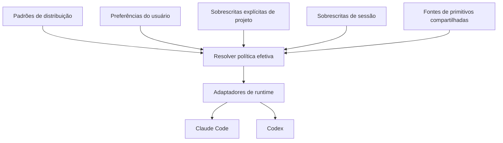

# Como o harness compartilhado funciona

Uma regra é escrita, recebe um detector ou uma razão declarada de por que não pode tê-lo, é
mantida sob isso pelo lint, e então medida. Tudo abaixo serve a esse ciclo. Suas preferências
selecionam comportamento de um catálogo de primitivos compartilhado, e os adaptadores do Claude
Code e do Codex projetam essa seleção nas instruções nativas, na descoberta de skill, nos papéis,
nos workflows, nas configurações e nos hooks de cada um. O runtime do agente continua responsável
por suas próprias permissões e restrições nativas.

## O ciclo de vida da regra

Regras são o único primitivo com um ciclo de medição ao redor delas, e ele roda em cinco passos.

1. **Escreva a regra.** Uma instrução por linha sob `primitives/rules/`, em segunda pessoa, com o
   raciocínio na skill à qual ela aponta, em vez de no próprio arquivo de regra.
2. **Nomeie um detector, ou diga por que não pode haver um.** Um detector em
   `claude/hooks/rule-detectors.py` decide, só a partir da transcrição, de forma determinística,
   se a regra estava em jogo. Uma regra sobre tom, altitude ou honestidade carrega em vez disso um
   motivo `OPT_OUT` de uma linha, e fica então no escuro de propósito, não por omissão.
3. **O lint aplica a escolha.** `check_detectors` em `bin/harness` falha o commit em uma regra que
   não tem nenhum dos dois, então uma regra não medida não consegue chegar silenciosamente.
4. **O relatório diz o que disparou.** `citizen usage --rules` conta acertos por regra na janela,
   `--by repo` por repositório e `--by stance` por `dimension=variant`, então uma taxa de acerto
   pode ser lida contra a variante de preferência que estava selecionada na hora. Os limiares, e o
   que os números não sustentam, estão em [usage](usage.md).
5. **Pode a regra que nunca dispara.** Um detector que o relatório marca como `unobserved` ao
   longo de sessões medidas o bastante é evidência sobre a regra. Duas funcionalidades lançadas
   pelo próprio repositório foram medidas não fazendo nada e registradas como bugs sobre essa
   evidência; [o levantamento de campo](field-scan.md) nomeia as duas, junto com as lacunas que
   qualificam todo número — a validade do detector não é medida, e as taxas por variante são
   observacionais, não um teste A/B.

## A autoridade e suas projeções



A precedência de resolução é padrões, usuário, projeto explícito, depois sessão. A sincronização
em nível de usuário projeta só os padrões do usuário; os hooks de ciclo de vida resolvem
sobrescritas de invocação sem alterar os links globais. `citizen stances --json` mostra a fonte, o
comportamento e a cobertura de adaptador. Restrições nativas sempre vencem. [A autoria de postura
personalizada](primitive-authoring.md) define nomenclatura, raízes e conflitos.

Regras guardam comportamento permanente. Posturas tornam escolhas pessoais explícitas e trocáveis;
são uma capacidade aqui entre várias, e três dos nove eixos se ligam a mecanismos de aplicação
enquanto o resto é prosa que troca de forma limpa. Skills guardam procedimentos. Papéis definem
responsabilidade, contexto e autoridade; ligações nativas selecionam ferramentas, modelos e
esforço. Workflows compõem essas peças, enquanto a apresentação define o formato de saída. Tudo é
escrito sob `primitives/`. Os caminhos de compatibilidade em `claude/` são projeções, não outra
fonte. Posturas personalizadas pertencem fora do checkout de distribuição.

`policy/hooks/` contém classificadores, portões e detectores compartilhados. `lib/harness_core/lifecycle.py`
compõe decisões; cada adaptador traduz eventos nativos. O registro é separado da confiança e da
ativação. Lacunas de aplicação pertencem a [controles de runtime](runtime-controls.md) e ao
[catálogo de compatibilidade](compatibility.md), não em alegações de que todo hook sempre aplica a
política.

O despacho é de coordenador único. Uma sincronização registra exatamente um comando por evento de
ciclo de vida que o runtime dispara — o `hook.py` do adaptador, que chama `lifecycle.dispatch` —
em vez de um comando por arquivo de política, então uma chamada de `Bash` gera um processo que
consulta o classificador somente-leitura, o avaliador de reversibilidade e o filtro de saída em
sequência, em vez de três que não conseguem ver as respostas uns dos outros. Isso também coloca a
precedência em um único lugar legível: qual política fala primeiro, e qual resposta sobrevive, é
código em `lifecycle.py`, não uma propriedade emergente da ordem de registro. O coordenador falha
fechado, porque uma política que não consegue rodar é indistinguível de uma que aprova: uma
exceção em qualquer ponto dentro do despacho nega uma chamada `PreToolUse` e bloqueia um `Stop`,
se nomeando. O registro é gerado, não escrito à mão, então `claude/settings.template.json` não
carrega nenhum bloco de hooks — `runtime_template()` fornece um a partir de
`lifecycle.registration()` no momento da sincronização, e uma entrada escrita nesse arquivo
manualmente seria descartada sem ser lida.

A postura `cost` adiciona uma tabela resolvida em cima dessa seleção — switches para a sessão, e
uma classe, um esforço e um orçamento flexível para cada papel e banda — que `policy/hooks/posture.py`
resolve uma vez para o dispatcher e para todo hook igualmente. Dois fatos moldaram onde ela
consegue agir. O esforço de raciocínio de um subagente nativo só existe em uma definição de agente
e não na chamada de spawn, então a postura alcança um spawn sendo escrita nessa definição no
momento da sincronização, e um spawn sem nome é roteado para um worker de banda que carrega uma,
em uma sessão cujo registro de agentes contém esse worker, seja porque já o continha no início ou
porque o runtime disse desde então que recarregou um, e caso contrário não é roteado de forma
alguma. E um agente só consegue orçar o que consegue contar, então o orçamento em um brief e o feed
que relata contra ele vêm ambos das mesmas medições locais. O que cada variante define:
[preferências](preferences.md#what-a-session-costs). Como é escrita:
[autoria de primitivo](primitive-authoring.md). O que é medido, e o que não é:
[usage](usage.md).

Um spawn, desenhado de cima para baixo, antes e depois dessa camada:
[delegação antes da camada de postura de custo](diagrams/delegation-before.html)
([imagem](diagrams/delegation-before-1440.png)) e
[delegação com ela](diagrams/delegation-with-cost-posture.html)
([imagem](diagrams/delegation-with-cost-posture-1440.png)). Os orçamentos de exemplo na segunda
são as linhas `balanced` distribuídas, semeadas a partir do p75 medido de uma máquina;
[semeie-as de novo](usage.md) a partir da sua própria.

## Trabalhando com arquivos instalados

[Sincronização e posse](sync-model.md) explica links, arquivos gerados, mesclagens estruturais,
diretórios de configuração e rollback. Mantenha o checkout compartilhado estável e o altere
através de worktrees. `citizen generate --check` detecta projeções de fonte desatualizadas, e
`citizen diff` compara artefatos instalados contra seu estado registrado. Dados pessoais ficam
fora do repositório. Mantenha um perfil pessoal de voz de escrita nas suas instruções pessoais
preservadas; veja [identidade](preferences.md#identity).

[Continuação de tarefa](task-continuation.md) e a [integração com o BMad](bmad.md) mantêm o estado
de tarefa e o estado de framework independentes das transcrições de runtime. [Uso](usage.md)
registra medições com lacunas explícitas. [Preferências](preferences.md) explica as escolhas de
predefinição; [a demonstração de postura](stance-demo.md) mostra um switch alcançando ambos os
runtimes e uma extensão personalizada.

## Disciplina de contexto

O orçamento central de instrução/regra/postura continua sendo verificado pelo lint. Skills e
apresentação detalhada carregam sob demanda. Instruções geradas por runtime e contexto de cliente
nativo ainda exigem qualificação; passar um orçamento de fonte não é evidência sobre o contexto
total ou a conformidade de um modelo.

**O limite que vale é de tokens, não de linhas.** Nenhum runtime trunca o que esta camada mede: o
Claude Code carrega um CLAUDE.md de até 4 MiB por completo e pula um maior, seu limite de 200
linhas se aplica somente ao `MEMORY.md` de memória automática, e seu "alvo abaixo de 200 linhas" é
um conselho de autoria para um arquivo, não uma soma sobre muitos
([documentação de memória](https://code.claude.com/docs/en/memory)). O que essa camada de fato
custa é medido: a issue #430 colocou o contexto permanente ao vivo do harness em 12.607 tokens
contra um perfil nu, estável a +/- 15 em oito pares de tarefas. `ALWAYS_LOADED_TOKEN_CAP` é um
terço desse número mais os 620 tokens da postura de voz `concise` (#811), então instruções, regras
e a variante mais longa de cada postura podem ocupar cerca de um terço do prefixo, e não mais. O
limite de 225 linhas permanece como uma guarda secundária, porque uma camada que é barata em
tokens mas se espalha por centenas de linhas curtas ainda é difícil de ler e difícil de obedecer.
Tokens são caracteres divididos por quatro, a mesma aproximação sem tokenizador que
`scripts/cost_bench.py` usa; `harness lint` imprime as duas medidas contra os dois limites em toda
execução e falha em qualquer um dos dois.

## Justificativa realocada das regras

As frases abaixo explicam regras que agora afirmam apenas a instrução.

- **Nunca abra um PR sobre trabalho não verificado**, porque um PR que falha no lint queima a
  atenção de um revisor à toa. Registre a saída esperada de árvore limpa nas instruções de agente
  do repositório na primeira vez que você rodar os gates: a linha exata de "todos os checks
  passaram", a contagem de testes, o aviso benigno conhecido. Aí qualquer desvio é seu, e você
  consegue distinguir uma falha pré-existente de uma que você causou. Teste autenticação de forma
  anônima, sem seguir redirecionamentos: um teste que segue redirecionamentos até uma página de
  login e afirma 200 não prova nada.
- **Contra-argumentação fundamentada em comentários de revisão** significa avaliar a legitimidade
  contra a base de código real primeiro — acionável, já resolvido, brincadeira, ou informativo —
  e, quando a análise discorda de um revisor (especialmente um formulado como suspeita em vez de
  diretiva), redigir uma contra-argumentação fundamentada em vez de obedecer cegamente.
- **Comandos de provisionamento são controlados por portão, e esse portão não é seu para levantar.**
  Quando um classificador de permissão recusa um comando de deploy ou apply, construa e valide
  tudo, rode o plano ou diff somente-leitura, e entregue ao usuário os comandos exatos. Rode um
  wrapper apenas quando o usuário o tiver nomeado ele mesmo.
- **Escale com parcimônia em loops autônomos.** Rodadas de revisão têm um teto de duas a três por
  história; o teto é um teto, não uma meta.
- **"Deveria funcionar" não é um status**, e quando um erro é relatado, você lê o erro real e os
  logs antes da fonte — nunca teorize só a partir do código.
- **Um segredo em um arquivo commitado não deixa de estar vazado quando você o apaga**; o
  histórico o mantém, e é por isso que a credencial precisa ser rotacionada antes de qualquer outra
  coisa acontecer. Diretórios de regras de agente são o caso para o qual essa regra existe: eles
  parecem privados e não são. Leia credenciais a partir do ambiente em vez disso:

  ```bash
  # Correto
  curl -H "Authorization: token $SERVICE_TOKEN" ...

  # Errado — nunca faça isso
  curl -H "Authorization: token abc123def456" ...
  ```

  CLIs de nuvem resolvem credenciais a partir de um perfil ou de um cofre de segredos; use
  `--profile` ou uma variável de ambiente, nunca uma chave colada.
