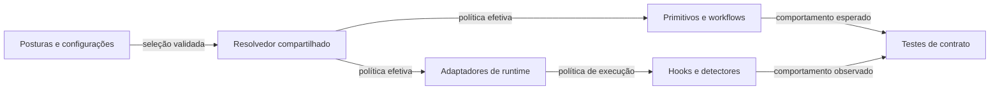

# Complete o contrato de postura e configurações

> Torne as preferências de fluxo de trabalho efetivas em todo o harness mantendo autorização,
> honestidade e proteção de segredos invariantes.
> Construa sobre a arquitetura de primitivo compartilhado, mova opiniões escondidas para escolhas
> explícitas, e teste a seleção através da execução.
> Esforço: substancial · Risco: desvio de política · Raio de impacto: instruções geradas,
> workflows, hooks de runtime e configuração do usuário.

## Em resumo

- **Resultado:** Toda preferência auditada tem uma escolha explícita e um contrato de
  implementação verificado.
- **Abordagem:** Repare switches existentes, extraia preferências fixas, depois valide seleções
  que interagem entre si.
- **Toca em:** Primitivos compartilhados, resolvedor, adaptadores de runtime, hooks, testes,
  configuração e documentação.
- **Novas dependências:** Nenhuma; reaproveita a base de primitivo compartilhado e runtime
  rastreada em #93–#100.
- **Fora de escopo:** Mesclar a pilha de PR existente, qualificação de cliente nativo, deploy ou
  mudanças nas configurações de usuário ao vivo.
- **Teste de saída:** As quatorze issues filhas passam em suas verificações de aceitação, gates
  locais e checks obrigatórios de PR.
- **Pergunta em aberto:** Empilhar a implementação sobre o PR #115, ou implementar contra a main
  atual e reconciliar depois?

## Design do sistema


Uma única seleção efetiva governa orientação e aplicação; restrições nativas continuam sendo o
teto.

## Passos

1. **[Estabeleça a base](#step-1--base-and-tracking)** — ligue toda mudança a uma issue e
   confirme o sequenciamento de implementação.
   *Saída:* todas as issues filhas existem e a decisão de base está registrada antes de a
   implementação começar.
2. **[Repare a semântica de seleção](#step-2--selection-contract)** — corrija contradições de
   voice/cost e defina a posse de política.
   *Saída:* testes de off/on/off, sobrescrita e restauração de valor do usuário passam nas duas
   projeções.
3. **[Extraia preferências fixas](#step-3--existing-opinions)** — adicione controles de
   verificação, ação externa, delegação, decisão e documentação.
   *Saída:* cada alternativa resolve sem regras, workflows ou skills contraditórios.
4. **[Adicione alternativas ausentes](#step-4--new-choices)** — entregue políticas de review,
   build-versus-buy, escopo de mudança e pesquisa.
   *Saída:* todas as variantes e as interações críticas de delegação/review passam nos testes de
   contrato.
5. **[Configure a mecânica de runtime](#step-5--settings-and-runtime-behavior)** — resolva
   orçamentos, telemetria e comportamento de gate centralmente.
   *Saída:* testes de limite, timeout, retenção, coleta desabilitada e adaptador passam.
6. **[Valide e documente](#step-6--verification-and-migration)** — exercite migração, posse e as
   seis superfícies de política.
   *Saída:* gates equivalentes à CI, Python de piso/atual, sincronização isolada e verificações
   de projeção aplicáveis passam no HEAD.
7. **[Revise e mescle](#step-7--delivery)** — publique mudanças verificadas, ligadas a issue, sem
   fechar trabalho não implementado.
   *Saída:* checks obrigatórios estão verdes no head atual e issues completas fecham através de
   implementação mesclada.

## Decisões para o revisor

1. **Qual base de implementação deve ser usada?**
   *Recomendação:* empilhar sobre o PR #115 e mesclar a implementação só depois que suas
   dependências entrarem; isso evita reconstruir código substituído.
   *Alternativa:* trabalhar contra a main atual, aceitando uma passagem de reconciliação separada
   através da pilha existente.

## Riscos

- **Mudanças de arquitetura concorrentes:** atualize a base e reconcilie os contratos afetados
  antes de cada PR de implementação.
- **Preferência confundida com permissão:** restrições nativas, requisitos de repositório e
  autorização de usuário sempre restringem a execução.
- **Crescimento de configuração:** preserve padrões, forneça predefinições, e mantenha perguntas
  avançadas opcionais em vez de alongar toda configuração.

---

# Adendo

## Passo 1 — Base e rastreamento

Status no momento da escrita: a implementação é proposta, não entregue. O usuário pediu issues,
um plano, testes, um PR e merge. O PR do plano pode mesclar independentemente; ele não fecha
issues de implementação. A pergunta sobre a base de implementação surgiu ao descobrir uma migração
de arquitetura concorrente e precisa ser respondida antes de mudanças de código dependentes. Não
infira aprovação do silêncio.

A fonte instalada é a v0.8.0, commit `f9591ba`. A fundação pendente é a pilha de PR
[#101](https://github.com/JakeSelby/agent-harness/pull/101) até
[#115](https://github.com/JakeSelby/agent-harness/pull/115), cujo head inspecionado é `3be4cc4`.
Este último introduz a autoridade de primitivo compartilhado, política de ciclo de vida de runtime
e workers de papel isolados. Continua sendo uma pilha de rascunho aberta com aceitação nativa não
resolvida; não a mescle como efeito colateral.

Rastreie este trabalho sob o [épico #116](https://github.com/JakeSelby/agent-harness/issues/116).
Cada issue filha possui seus próprios critérios de aceitação detalhados; os links a seguir são o
mapa de entrega:

1. [#117 — Seleções existentes efetivas](https://github.com/JakeSelby/agent-harness/issues/117).
2. [#118 — Política de verificação](https://github.com/JakeSelby/agent-harness/issues/118).
3. [#119 — Autorização de ação externa](https://github.com/JakeSelby/agent-harness/issues/119).
4. [#120 — Topologia de delegação](https://github.com/JakeSelby/agent-harness/issues/120).
5. [#121 — Interação de decisão](https://github.com/JakeSelby/agent-harness/issues/121).
6. [#122 — Documentação e histórico](https://github.com/JakeSelby/agent-harness/issues/122).
7. [#123 — Ciclo de vida de contexto e orçamentos](https://github.com/JakeSelby/agent-harness/issues/123).
8. [#124 — Profundidade e independência de review](https://github.com/JakeSelby/agent-harness/issues/124).
9. [#125 — Alternativas build-versus-buy](https://github.com/JakeSelby/agent-harness/issues/125).
10. [#126 — Escopo de mudança](https://github.com/JakeSelby/agent-harness/issues/126).
11. [#127 — Profundidade de pesquisa](https://github.com/JakeSelby/agent-harness/issues/127).
12. [#128 — Controles de observabilidade](https://github.com/JakeSelby/agent-harness/issues/128).
13. [#129 — Comportamento de gate](https://github.com/JakeSelby/agent-harness/issues/129).
14. [#130 — Cobertura, migração e documentação](https://github.com/JakeSelby/agent-harness/issues/130).

## Passo 2 — Contrato de seleção

Use quatro classes de política:

- **Invariantes:** resultados verdadeiros, incerteza, proteção de segredo, autorização e
  restrições nativas.
- **Posturas:** alternativas comportamentais significativas que um usuário razoável poderia
  preferir.
- **Configurações:** limites, durações, retenção e mecânica de execução.
- **Predefinições:** seleções iniciais documentadas, nunca travas que sobrescrevem configurações
  explícitas do usuário.

Escreva em `primitives/` sobre a fundação pendente, usando `lib/harness_core/catalog.py` e o
resolvedor de configuração existente. Não construa um segundo catálogo de postura em `claude/` ou
em arquivos do Codex. `policy/hooks/` e `lib/harness_core/lifecycle.py` possuem o comportamento de
runtime; adaptadores o projetam. Antes de editar, releia esses caminhos na base selecionada porque
a pilha pendente pode alterá-los.

Mantenha a precedência padrão → usuário → projeto explicitamente selecionado → sessão para
escolhas de postura. Retenha a restrição existente de que a configuração de projeto pode
selecionar posturas, não permissão, identidade ou alvos de runtime. Novas configurações
operacionais pertencem inicialmente à configuração de usuário; sobrescritas de sessão precisam
estar explicitamente na lista de permissões e validadas. Custo fornece padrões numéricos, depois
configurações explícitas os sobrescrevem. Nenhum valor de tarefa/sessão pode persistir para outra
sessão.

Defina `off` por dimensão: isso remove a preferência do harness, não restrições de prioridade mais
alta. Preserve e restaure valores possuídos pelo usuário durante transições de posse; nunca
simplesmente apague o estilo de saída de um usuário porque o harness parou de gerenciá-lo.
Seleções desconhecidas falham antes de qualquer mutação.

O registro de posse de toda política nomeia seis superfícies: texto de regra, skills, workflows,
configurações, hooks e detectores. Marque superfícies não aplicáveis explicitamente. Teste
comportamento, não apenas existência de arquivo.

## Passo 3 — Opiniões existentes

As seleções propostas e os padrões de migração são:

- **Verificação:** `local-first` (padrão), `ci-authoritative`, `hybrid`; independente de
  requisitos de escrita de teste.
- **Testes de integração:** `fixtures-only` (padrão), `explicit-live`, `repo-native`; nenhuma
  autorização de endpoint implícita.
- **Ações externas:** `draft-first` (padrão), `explicit-request`, `scoped-standing-authority`.
- **Escritas de delegação:** `serial` (padrão), `isolated-worktrees`;
  `max_delegation_depth=1` significa só de raiz para filho.
- **Interface de decisão:** `prose` (padrão), `structured`, `adaptive`; preserve a aprovação
  explícita independentemente da interface.
- **Documentação:** `concise-reference` (padrão), `explanatory`, `repo-native`.
- **Histórico de documento:** `append-only` (padrão), `living`; migrações aplicadas e evidência de
  auditoria continuam protegidas.

Escopos de ação externa nomeiam ação, destino e expiração/revogação. Não use uma postura em prosa
como prova de aplicação em runtime nem como um jeito de contornar uma negação nativa. Workers
confinados continuam incapazes de redelegar; qualquer mudança futura de contrato de worker precisa
de sua própria evidência de confinamento.

Ajuste todas as skills e workflows consumidores, incluindo autoria, plan, build e review. Separe
requisitos de documento voltado ao público de referências de engenharia privadas. Respeite
templates de PR do repositório sem impor uma quantidade única e universal de prosa.

## Passo 4 — Novas escolhas

- **Review:** `scope-and-quality` (padrão), `self-check`, `independent`, `risk-adaptive`.
- **Independência de review:** `fresh-context` (padrão), `different-family`; relate
  indisponibilidade de independência explicitamente.
- **Build versus buy:** retenha `capability-ceiling` como padrão e `off`; adicione
  `delivery-speed`, `operational-maturity`, `balanced`.
- **Escopo de mudança:** `minimal-diff` (padrão), `local-cleanup`, `systemic-fix`; nenhuma
  permite trabalho não relacionado.
- **Pesquisa:** `source-led` (padrão), `quick-check`, `exhaustive`; todas retêm atribuição e
  incerteza.

O novo padrão explícito de fresh-context resolve a antiga regra ambígua que combinava família e
contexto; registre isso como um esclarecimento de política nas notas de migração em vez de alegar
comportamento idêntico byte a byte. Quando a delegação está desligada, não lance silenciosamente um
revisor. Relate que a review independente permanece não realizada, ou use self-check apenas quando
a política/usuário selecionado permitir.

Review risk-adaptive precisa publicar critérios de seleção determinísticos antes da implementação:
edições triviais só de apresentação podem se autoavaliar; mudanças de lógica exigem review
independente; mudanças de autorização, segredos, persistência e migração exigem review de escopo e
qualidade separado. Capacidades ausentes não podem rebaixar silenciosamente a review exigida.

## Passo 5 — Configurações e comportamento de runtime

- **Contexto:** `cost-default` (padrão), `preserve-cache`, `adaptive`, `handoff`.
- **Orçamentos:** limites de palavra de gather/digest, contagem de busca, fan-out e rodadas de
  review; preserve os padrões de retorno 400/600.
- **Telemetria:** `observability.enabled=true`, `retention_days=0`, `include_repo=true`,
  `include_branch=true`.
- **Gates:** `gates.mode=blocking`, `gates.max_blocks=8`, `gates.timeout_seconds=240`; adicione o
  modo `advisory`.

Retenção zero significa nenhuma expiração automática, preservando o histórico armazenado atual.
Optar por sair de metadados afeta registros novos; purgar registros existentes é uma operação
explícita separada. Telemetria desabilitada precisa parar workers destacados e novas varreduras,
além da instalação de hook. Nunca adicione corpos de comando ou mensagem aos registros de uso.
Teste escritores concorrentes e limites de expiração em UTC.

Schemas numéricos precisam rejeitar booleanos disfarçados de inteiros, valores malformados e
limites inválidos. Publique os intervalos permitidos e o comportamento de limite rígido de
provedor antes de expor cada configuração. Um orçamento de usuário maior nunca sobrescreve um
limite de provedor. Não fixe no código limites de fornecedor atuais como fatos universais.

Gates consultivos e de bloqueio esgotados podem liberar um turno; nenhum dos dois resultados prova
que o gate passou. Preserve distinções de identidade de árvore suja, confiança, cancelamento e erro
da fundação de runtime.

## Passo 6 — Verificação e migração

Leia o `.github/workflows/ci.yml` e o `AGENTS.md` atuais no checkout selecionado antes de rodar os
gates. A branch de plano atual exige:

```sh
python3 bin/harness lint
python3 -m unittest discover -s tests -v
python3 bin/harness sync --dry-run
```

Para o dry-run, rode um subprocesso com um diretório home temporário contendo apenas uma cópia de
`config.example.json`; não sobrescreva a configuração real nem instale um candidato no harness ao
vivo. Preserve o ambiente de sessão normal fora desse subprocesso. Nenhum formatador está
configurado na CI inspecionada; verifique por novos requisitos de formatador se a base mudar.

Na fundação de primitivos compartilhados, também rode `python3 bin/harness generate --check`. Rode
a suíte de teste sob o Python 3.9 e o Python atual suportado antes de a implementação ser
mesclada. Testes de fonte bem-sucedidos não qualificam clientes nativos; exercite adaptadores
disponíveis e relate explicitamente qualquer sondagem nativa bloqueada. Não remova um gate de
qualificação nativa para lançar este trabalho.

A cobertura de interação exigida inclui custo/contexto, posse de voice/style, review/delegação,
testes/verificação/gates e autonomy/ações externas. Cubra cada variante individualmente mais estes
pares significativos; não alegue que um produto cartesiano exaustivo foi exercitado. Inclua
migração de configuração antiga, sincronização repetida, restauração de desinstalação, combinações
inválidas, escopo de sessão e posturas personalizadas introduzidas pela fundação.

Mantenha o orçamento de contexto sempre carregado: extraia justificativa para skills/docs, meça a
variante mais longa em cada dimensão e evite elevar o limite só para caber mais switches. Ofereça
predefinições e um caminho de configuração avançada opcional; não faça toda pergunta nova em toda
inicialização.

## Passo 7 — Entrega

Use um commit/PR de implementação por issue, quando prático, em ordem de dependência. Mantenha
escritas de thread único sob a política atual. Use worktrees isoladas e deixe trabalho não
relacionado intocado. O PR do plano atual contém apenas este documento e referencia o épico sem
fechá-lo. Ele pode ser mesclado depois que as verificações locais e os checks remotos obrigatórios
passarem.

Para a implementação, rode os gates no HEAD commitado no checkout sendo enviado (push). Preencha
toda seção do template de PR e referencie sua issue. Inspecione o status dos checks depois do
último push; faça squash merge através da proteção do repositório sem bypass administrativo.
Reverifique o resultado do merge e o status da issue. Se a base aprovada estiver empilhada, mescle
somente depois que as dependências existentes entrarem, depois atualize e rode de novo os gates no
diff resultante baseado na main.

Atualize a documentação para dizer: "Padrões fortes, trade-offs explícitos, e preferências de
workflow configuráveis." Descreva o suporte separadamente como orientação, aplicação testada por
fonte ou aplicação testada nativamente. Retenha evidência e limitações em vez de alegar que todas
as preferências são igualmente aplicáveis em todo cliente. Feche o épico somente quando todos os
critérios de aceitação das issues filhas estiverem satisfeitos.
